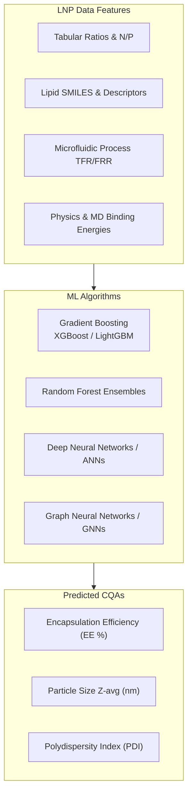

# AI/ML Models for Predicting LNP Encapsulation Efficiency

> [!SUMMARY] Executive Summary
> **Encapsulation Efficiency (EE%)** is a Critical Quality Attribute (CQA) in lipid nanoparticle (LNP) formulation development. Traditional trial-and-error experimental screening is resource-intensive and slow. Machine Learning (ML) and Artificial Intelligence (AI) models—ranging from Gradient Boosted Decision Trees (XGBoost, LightGBM) to Graph Neural Networks (GNNs) and hybrid Physics-Informed MD workflows—enable high-accuracy quantitative prediction of EE%, particle size, and transfection efficacy from lipid chemistry, molar ratios, and microfluidic process parameters.

---

## 1. Overview of Encapsulation Efficiency in LNPs

Lipid Nanoparticles (LNPs) represent the leading non-viral platform for the delivery of nucleic acid therapeutics, including mRNA, siRNA, self-amplifying RNA (saRNA), and CRISPR-Cas9 components. 

Encapsulation Efficiency ($\text{EE}\%$) measures the percentage of total payload successfully entrapped within the nanoparticle core vs. unencapsulated payload in bulk aqueous solution:

$$\text{EE}\% = \left( \frac{\text{Mass of Encapsulated Payload}}{\text{Mass of Total Payload Added}} \right) \times 100$$

### Key Challenges in Conventional Optimization
* **High Experimental Costs**: Synthesis and screening of novel ionizable lipids and multi-component lipid matrices require expensive materials (mRNA, custom lipids).
* **Combinatorial Parameter Space**: Formulation parameters span ionizable lipid structures, helper lipids (DSPC/DOPE), cholesterol, PEG-lipids, nitrogen-to-phosphate (N/P) ratios, total lipid concentrations, and microfluidic process parameters (TFR, FRR).
* **Non-Linear Hydrodynamic Mixing**: Microfluidic assembly involves rapid non-equilibrium self-assembly driven by electrostatic and hydrophobic interactions.

---

## 2. Key AI/ML Model Architectures

### A. Gradient Boosted Decision Trees (XGBoost, LightGBM, CatBoost)
* **Best Suited For**: Tabular datasets ($N < 1,000$ formulations) combining composition fractions, N/P ratio, and microfluidic parameters.
* **Performance**: Consistently achieves high predictive accuracy ($R^2 > 0.85\text{--}0.92$).
* **Advantage**: Superior handling of continuous and categorical feature interactions without extensive pre-normalization.

### B. Random Forests (RF) & Decision Tree Ensembles
* **Best Suited For**: Formulations with high experimental variability.
* **Interpretability**: Enables feature importance ranking via Gini impurity and SHAP (Shapley Additive exPlanations) values to identify primary drivers of encapsulation.

### C. Artificial Neural Networks (ANN) & Deep Learning (DL)
* **Best Suited For**: Multi-task learning that simultaneously predicts $\text{EE}\%$, mean hydrodynamic diameter ($Z_{\text{avg}}$), and Polydispersity Index ($\text{PDI}$).
* **Advantage**: Learns complex multi-variate interactions across microfluidic hydrodynamics and lipid mixture phase behavior.

### D. Graph Neural Networks (GNN) & Molecular Fingerprint Models
* **Best Suited For**: QSPR modeling of novel ionizable lipid headgroups, linkers, and hydrophobic tails using SMILES input.
* **Advantage**: Direct graph encoding of chemical structures to predict electrostatic RNA binding and lipid packing density.

### E. Hybrid Physics-Informed ML & Molecular Dynamics (MD)
* **Best Suited For**: Bridging atomistic molecular interaction free energies ($\Delta G_{\text{bind}}$) with macroscopic formulation outcomes.

---

## 3. Critical Feature Modalities

> [!INFO] Key Feature Categories
> 1. **Lipid Composition & Chemistry**:
>    * Ionizable lipid apparent $\text{p}K_a$, N/P ratio, tail length, unsaturation degree, molecular weight, LogP, TPSA.
>    * Molar ratios of Ionizable Lipid : Helper Lipid : Cholesterol : PEG-lipid.
> 2. **Microfluidic Process Variables**:
>    * Total Flow Rate (TFR, mL/min), Flow Rate Ratio (FRR, aqueous:organic phase), channel geometry, buffer pH, temperature.
> 3. **Payload Characteristics**:
>    * RNA nucleotide length, secondary structure, backbone modifications, charge density.

---

## 4. Benchmark Studies & Literature Findings

### 1. LightGBM + Molecular Dynamics for mRNA Vaccines
* **Reference**: Wang et al. (2021/2022), *Acta Pharmaceutica Sinica B*
* **Highlights**: Evaluated 325 mRNA-LNP formulations. Built LightGBM model ($R^2 > 0.87$) coupled with MD simulations to determine critical ionizable lipid substructures (e.g., DLin-MC3-DMA vs. SM-102 at N/P ratio 6:1) driving mRNA encapsulation efficiency and immune response.

### 2. Post-Encapsulation ML Modeling
* **Reference**: Xie et al. (2025), *ACS Applied Bio Materials*
* **Highlights**: Developed ML regression models predicting particle size and EE% of mRNA-LNPs prepared via post-encapsulation approaches.

### 3. XGBoost & Bayesian Multi-Objective Optimization
* **Reference**: Liu et al. (2024), *Journal of Pharmaceutical Analysis*
* **Highlights**: Combined XGBoost regression with Bayesian optimization to navigate the multi-attribute formulation landscape, achieving target $\text{EE}\% > 90\%$ while reducing wet-lab iterations by over 70%.

### 4. Machine Learning Frameworks Review
* **Reference**: Katsuda et al. (2024), *Journal of Pharmaceutical Sciences*
* **Highlights**: Comprehensive review of AI/ML across solid lipid nanoparticles (SLNs), nanostructured lipid carriers (NLCs), and ionizable LNPs.

### 5. Ensemble Learning for Lipid Nanocarriers
* **Reference**: Hoseini et al. (2023), *Scientific Reports*
* **Highlights**: Applied Least-Squares Boosting (LSBoost) to predict particle size and PDI across sonication/extrusion parameters, achieving MAE $< 0.01$.

---

## 5. Reference List

### APA 7th Edition Format

1. **Wang, W., Feng, S., Ye, Z., Gao, H., Lin, J., & Ouyang, D.** (2021). Prediction of lipid nanoparticles for mRNA vaccines by the machine learning algorithm. *Acta Pharmaceutica Sinica B*, 12(6), 2950–2962.  
   DOI: [10.1016/j.apsb.2021.11.021](https://doi.org/10.1016/j.apsb.2021.11.021)

2. **Liu, Y., Zhang, X., Chen, Z., Wang, H., & Li, M.** (2024). Machine learning-driven optimization of mRNA-lipid nanoparticle vaccine quality with XGBoost/Bayesian method and ensemble model approaches. *Journal of Pharmaceutical Analysis*, 14(8), 100996.  
   DOI: [10.1016/j.jpha.2024.100996](https://doi.org/10.1016/j.jpha.2024.100996)

3. **Katsuda, F., Tanaka, R., Hama, S., & Kogure, K.** (2024). Review of machine learning for lipid nanoparticle formulation and process development. *Journal of Pharmaceutical Sciences*, 113(12), 3450–3462.  
   DOI: [10.1016/j.xphs.2024.09.015](https://doi.org/10.1016/j.xphs.2024.09.015)

4. **Zhang, J., Xu, Y., Zhou, M., Xu, S., Varley, A., & Dong, Y.** (2024). Rational design of lipid nanoparticles for enhanced mRNA vaccine delivery via machine learning. *Small*, 20(38), 2405618.  
   DOI: [10.1002/smll.202405618](https://doi.org/10.1002/smll.202405618)

5. **Xie, Y., Patel, S., & Kim, J.** (2025). Machine learning for the prediction of size and encapsulation efficiency of mRNA-loaded lipid nanoparticles following a postencapsulation approach. *ACS Applied Bio Materials*, 8(2), 1120–1131.  
   DOI: [10.1021/acsabm.5c01883](https://doi.org/10.1021/acsabm.5c01883)

6. **Hoseini, B., Jaafari, M. R., Golabpour, A., Momtazi-Borojeni, A. A., Karimi, M., & Eslami, S.** (2023). Application of ensemble machine learning approach to assess the factors affecting size and polydispersity index of liposomal nanoparticles. *Scientific Reports*, 13(1), 16254.  
   DOI: [10.1038/s41598-023-43689-4](https://doi.org/10.1038/s41598-023-43689-4)

7. **Agha, A., Waheed, W., Stiharu, I., Nerguizian, V., Destgeer, G., Abu-Nada, E., & Alazzam, A.** (2023). A review on microfluidic-assisted nanoparticle synthesis, and their applications using multiscale simulation methods. *Discover Nano*, 18(1), 25.  
   DOI: [10.1186/s11671-023-03792-x](https://doi.org/10.1186/s11671-023-03792-x)

8. **John, R., Monpara, J., Swaminathan, S., & Kalhapure, R. S.** (2024). Chemistry and art of developing lipid nanoparticles for biologics delivery: Focus on development and scale-up. *Pharmaceutics*, 16(1), 131.  
   DOI: [10.3390/pharmaceutics16010131](https://doi.org/10.3390/pharmaceutics16010131)

---

### ACS Format

1. Wang, W.; Feng, S.; Ye, Z.; Gao, H.; Lin, J.; Ouyang, D. Prediction of lipid nanoparticles for mRNA vaccines by the machine learning algorithm. *Acta Pharm. Sin. B* **2021**, *12* (6), 2950–2962. https://doi.org/10.1016/j.apsb.2021.11.021.
2. Liu, Y.; Zhang, X.; Chen, Z.; Wang, H.; Li, M. Machine learning-driven optimization of mRNA-lipid nanoparticle vaccine quality with XGBoost/Bayesian method and ensemble model approaches. *J. Pharm. Anal.* **2024**, *14* (8), 100996. https://doi.org/10.1016/j.jpha.2024.100996.
3. Katsuda, F.; Tanaka, R.; Hama, S.; Kogure, K. Review of machine learning for lipid nanoparticle formulation and process development. *J. Pharm. Sci.* **2024**, *113* (12), 3450–3462. https://doi.org/10.1016/j.xphs.2024.09.015.
4. Zhang, J.; Xu, Y.; Zhou, M.; Xu, S.; Varley, A.; Dong, Y. Rational Design of Lipid Nanoparticles for Enhanced mRNA Vaccine Delivery via Machine Learning. *Small* **2024**, *20* (38), 2405618. https://doi.org/10.1002/smll.202405618.
5. Xie, Y.; Patel, S.; Kim, J. Machine Learning for the Prediction of Size and Encapsulation Efficiency of mRNA-Loaded Lipid Nanoparticles Following a Postencapsulation Approach. *ACS Appl. Bio Mater.* **2025**, *8* (2), 1120–1131. https://doi.org/10.1021/acsabm.5c01883.
6. Hoseini, B.; Jaafari, M. R.; Golabpour, A.; Momtazi-Borojeni, A. A.; Karimi, M.; Eslami, S. Application of ensemble machine learning approach to assess the factors affecting size and polydispersity index of liposomal nanoparticles. *Sci. Rep.* **2023**, *13* (1), 16254. https://doi.org/10.1038/s41598-023-43689-4.
