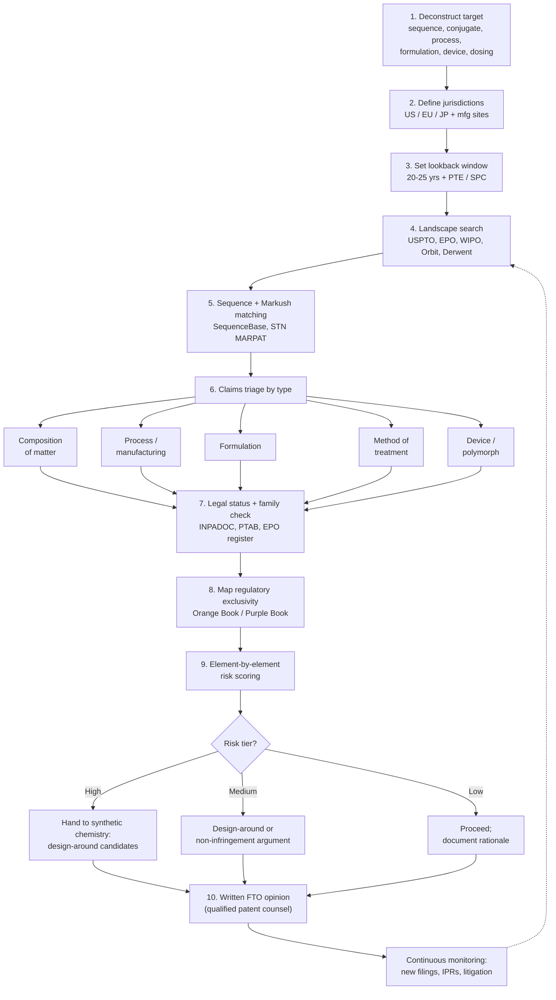

# FTO & Exclusivity Analysis Pipeline for Peptide Therapeutics — Semaglutide Case Study

2026-09-19 · @Someone

## Overview

A peptide therapeutic sits at the intersection of two overlapping patent estates and a separate regulatory exclusivity clock. Composition of matter, the lipidation or conjugation chemistry, the synthetic process, the formulation, the delivery device, and the method of treatment can each carry an independently-expiring patent. A single "is this compound novel" check misses most of the real risk.

This document lays out a repeatable pipeline for freedom-to-operate (FTO) and exclusivity analysis on a peptide asset: the stages, the tools each stage needs, what a synthetic chemist specifically needs handed to them, which parts of a patent actually drive the analysis, and a worked example against semaglutide.

## FTO vs. exclusivity, and why peptides are different

FTO and exclusivity answer different questions and run on different clocks.

|  | Freedom to operate | Regulatory exclusivity |
| --- | --- | --- |
| Question | Would making, using, or selling this infringe someone else's valid patent? | Is the FDA/EMA barred from approving a competing product yet, regardless of patents? |
| Source | Third-party patent claims (composition, process, formulation, use, device) | Statute (Hatch-Waxman NCE/NCE-1, orphan drug, pediatric, BPCIA reference-product exclusivity) |
| Depends on | Claim scope, validity, your own product's structure and process | Approval pathway and date only — unrelated to whether any patent exists |
| Who grants/enforces | Courts, via infringement litigation | FDA/EMA, administratively |
| Ends when | Patent expires, is invalidated, or you design around it | Statutory period runs out, independent of any patent |

A product can be completely free of exclusivity and still blocked by patents, or vice versa — both clocks have to be checked, and the binding constraint on market entry is whichever runs longest.

Peptides sit awkwardly between the two toolkits pharma IP teams already have. Like small molecules, they need Markush/genus structure searching because compound patents claim broad substituent variables (chain length, linker chemistry, protecting groups). Like biologics, they need sequence searching, because the core pharmacophore is a string of residues that can be claimed by percentage identity or functional homology rather than an exact structure. And unlike either, their FDA classification is not automatic: the regulatory line between a chemically-synthesized "drug" (Section 505, Orange Book, Hatch-Waxman exclusivity) and a "biologic" (Section 351, Purple Book, BPCIA exclusivity) is drawn at 40 amino acids. A 31-residue analog and a 45-residue analog in the same peptide class can land on opposite sides of that line, with very different exclusivity terms — this has to be settled early, since it changes which database and which exclusivity rules apply.

## The pipeline

Ten stages, run in order once and then re-run at each development milestone — the patent landscape moves continuously, so a one-time FTO at ideation is stale by IND.

1. **Deconstruct the target.** Split the asset into independent IP layers — the amino acid sequence and any non-natural residues, the conjugation/lipidation chemistry, the synthetic route, the salt or polymorph form, the formulation and excipients, the delivery device, and the intended dosing regimen. Each layer gets its own search.
2. **Define jurisdictions.** Manufacturing sites and commercial markets each create FTO exposure independently. A baseline covers the US, EU (major states), Japan, and wherever the API or drug product is actually made.
3. **Set the lookback window.** Go back at least 20–25 years to capture standard patent terms plus extensions — US Patent Term Extension and EU Supplementary Protection Certificates can each add up to 5 years beyond the nominal 20-year term.
4. **Landscape search.** Keyword, classification (CPC A61K38/26 for GLP-1-type peptides, C07K14 for peptide chemistry), and assignee searches build the candidate set of potentially relevant families.
5. **Sequence and Markush matching.** Run the actual sequence against patent sequence databases, and run the actual chemical structure (including the conjugate) as a substructure query against Markush-claimed genus structures. Keyword search alone misses both.
6. **Claims triage by type.** Sort every hit into composition of matter, process/manufacturing, formulation, method of treatment, polymorph/salt, and device — each needs a different design-around strategy.
7. **Legal status and family check.** Confirm each candidate patent is still in force (maintenance fees current, not lapsed, not invalidated), and pull every family member across jurisdictions, since claim scope often differs by country.
8. **Map regulatory exclusivity.** Separately from patents, chart NCE/pediatric/orphan exclusivity (small-molecule pathway) or BPCIA reference-product exclusivity (biologic pathway) against the approval date.
9. **Element-by-element risk scoring.** For each surviving patent, map every limitation of the independent claims onto your actual product and process; tier as high/medium/low risk and flag doctrine-of-equivalents exposure on anything designed around.
10. **Design-around and FTO opinion.** Feed the high- and medium-risk findings back to synthetic chemistry for design-around options, then commission a written FTO opinion from qualified patent counsel — the opinion, not the internal search, is what has evidentiary weight if litigation follows.

Monitoring runs continuously from this point: new publications from the same assignees, continuation applications in the same families, and IPR/opposition outcomes can all move the picture after the initial analysis is done.

## Tools and databases by stage

No single database covers a peptide's full IP surface — structure/Markush tools and sequence tools are both needed, plus separate regulatory and legal-status sources.

| Pipeline stage | Tool / database | What it's for |
| --- | --- | --- |
| Landscape search | USPTO Patent Public Search, Espacenet, WIPO PATENTSCOPE, Google Patents, The Lens | Free full-text and classification search across jurisdictions |
| Landscape search | Clarivate Derwent Innovation, Questel Orbit Intelligence, PatSnap | Commercial full-family search, analytics, assignee mapping |
| Sequence matching | Clarivate SequenceBase, GenomeQuest/Questel sequence search, EBI/EPO patent sequence databases | BLAST-style search of the peptide sequence (and close variants) against sequences claimed or disclosed in patents |
| Markush / structure matching | CAS STNext + MARPAT, SciFinder-n, IBM PatCID | Substructure search against genus (Markush) claims covering conjugates, linkers, and acylated analogs |
| Chemistry / synthesis reference | Reaxys, SciFinder, PubChem, CAS Common Chemistry | Confirming exact structures, known synthetic routes, and prior art compounds |
| Legal status & family | INPADOC/Espacenet legal status, Questel Orbit family tool, USPTO Patent Assignment & PTAB records | In-force status, patent term adjustment/extension, terminal disclaimers, opposition/IPR outcomes |
| US regulatory exclusivity | FDA Orange Book (small-molecule/NDA pathway) | Patents listed against the approved drug, and NCE/pediatric exclusivity |
| US regulatory exclusivity (biologics) | FDA Purple Book | BPCIA reference-product exclusivity for peptides ≥40 amino acids approved as BLAs |
| EU exclusivity | EPO Register, national SPC registers | Supplementary Protection Certificate terms, EMA data/market exclusivity |
| Litigation & claim construction | PACER, Docket Navigator, Lex Machina, USPTO PTAB (P-TACTS) | Infringement suits, IPR petitions, and how courts have actually construed the relevant claims |
| Commercial/IP context | DrugPatentWatch, GreyB, Markman Advisors and similar pharma-IP trackers | Curated patent-expiry timelines and litigation summaries as a cross-check, not a primary source |
| Claim mapping / charting | Innography IPQwery, ClaimScape, or a structured spreadsheet/claim chart | Element-by-element mapping of claim limitations to the product for risk scoring |

Treat the commercial trackers as a starting map, not the record — always confirm patent numbers, claim scope, and status against the primary source (USPTO/EPO record, Orange/Purple Book) before relying on them.

## What the synthetic chemist needs from the FTO team

The FTO team's output is only useful to chemistry if it goes beyond "patent X is a risk" and says which specific structural features drove that conclusion. Five things need to be handed over explicitly:

1. **Which residues are conserved (claimed narrowly) vs. variable (claimed broadly).** A patent that recites the exact sequence gives real design room at non-critical positions; a patent that claims "X₁ is any of Ala, Aib, or a C1–C4 alkyl-substituted residue" at a given position has already fenced off that whole variable — substituting within the claimed set doesn't design around it.
2. **The conjugation chemistry as its own claim element**, separate from the peptide backbone: attachment residue/position, spacer or linker composition, and fatty acid/diacid chain length. These are frequently claimed as an independent genus (a Markush formula over linker length and chain length), so a chemist changing "the fatty acid" needs to know the claimed range, not just the exemplified compound.
3. **Percentage-identity and functional-equivalent language.** Claims written as "a peptide having at least 90% sequence identity to SEQ ID NO: 1 and retaining GLP-1 receptor agonist activity" cover a much larger design space than the single exemplified sequence — a chemist's "different" analog can still fall inside that claim.
4. **Process claims are a separate design-around lever from composition claims.** If the blocking claim covers a specific synthetic route (a resin, a coupling reagent, a protecting-group strategy, a specific purification step), switching route — solid-phase vs. hybrid solution-phase synthesis, enzymatic vs. chemical conjugation — can clear the patent even while making the identical final molecule, as long as the composition-of-matter claim on that molecule has expired or doesn't exist.
5. **Formulation, salt/polymorph, and device claims sit outside the API chemistry entirely.** A chemist who clears every composition and process claim can still be blocked by an excipient/absorption-enhancer claim (oral peptide formulations lean heavily on these) or a specific salt form — these need their own line item, not an assumption that "the peptide is clear."

The practical output for chemistry should be a short table per candidate design-around: the residue/moiety in question, the claim(s) that fence it, the claimed range vs. the proposed change, and whether the change lands inside or outside that range.

## Which parts of a patent actually drive the analysis

A patent is not just its claims, and not every claim matters equally.

- **Independent claims first, dependent claims second.** Only independent claims set the outer boundary of what's protected; dependent claims narrow further and matter mainly for validity arguments and design-around headroom (a dependent claim reciting the exact commercial embodiment is often the hardest to invalidate but the easiest to design around).
- **Markush variables in the claim, read literally.** For a genus claim, the definitions of each variable (R groups, chain-length ranges, "optionally substituted") are the actual scope — not the one worked example the reader remembers.
- **The specification's working examples.** Claim scope beyond what's actually exemplified and enabled in the specification is a validity weakness (lack of written description/enablement) — useful both for risk-scoring a broad claim and for building an invalidity position if needed.
- **The prosecution file wrapper (file history).** Amendments and arguments made to get the claim allowed can create prosecution history estoppel, narrowing what the patentee can later argue the claim covers — this is where a claim that looks broad on its face often turns out to be narrower in practice.
- **The patent family, not just one member.** The same invention can carry different claim scope in the US, EP, and JP filings; a claim that's broad in one jurisdiction may have been narrowed during prosecution in another.
- **Legal status and term-extending events.** Grant date alone is not the expiry date — Patent Term Adjustment/Extension (US) and Supplementary Protection Certificates (EU) can each add years, while a terminal disclaimer can tie a patent's expiry to an earlier one in the same family.
- **Litigation and IPR/opposition outcomes.** A claim that has been construed narrowly by a court, or partially invalidated in an IPR, has a different real-world scope than its granted text — always check for post-grant proceedings before treating a claim's scope as fixed.

## Case study: applying the pipeline to semaglutide

**Stage 1 — deconstruct the target.** Semaglutide is human GLP-1(7-37) with three changes: Ala8→Aib (2-aminoisobutyric acid, blocks DPP-4 cleavage), Lys34→Arg (removes the second acylation site so conjugation happens only at Lys26), and a Lys26 side chain carrying a spacer (two AEEA/8-amino-3,6-dioxaoctanoic acid units plus a γ-Glu) attached to an octadecanedioic (C18) fatty diacid for albumin binding. That diacid-and-spacer combination — longer chain, extra spacer unit than liraglutide's C16 mono-acid — is what stretches half-life from once-daily (liraglutide) to once-weekly. Separately, the oral formulation (Rybelsus) adds SNAC (salcaprozate sodium) as an absorption enhancer, and each format uses its own injection device or tablet formulation.

**Stages 4–6 — landscape, matching, and claim types found.** Applying CPC A61K38/26 plus assignee filtering on Novo Nordisk, and running the sequence and the acylated structure as separate queries, surfaces distinct claim families: a compound/composition-of-matter claim on the acylated analog itself, a method-of-use claim on dosing regimens for type 2 diabetes and obesity, an oral-formulation claim tied specifically to the SNAC-based tablet, and device claims on the injector pen.

**Stage 7–9 — status, exclusivity, and current risk picture**, pulled directly from the FDA Orange Book's patent-info pages for each of the three NDAs (Ozempic 209637, Wegovy 215256, Rybelsus 213051), cross-checked against Google Patents (mirrors USPTO grant data) and the EPO register. The Orange Book lists far more patents per product than any single table can hold usefully (16 for Ozempic, 8 for Wegovy, 15 for Rybelsus) — the condensed table below shows the highest-value entries by claim type; the full lists, with every patent number, expiry, and use code, are in the attached `semaglutide_fto_data.json`.

| Product (NDA) | Patent no. | Claim type | Expiry | Notes |
| --- | --- | --- | --- | --- |
| Ozempic (209637) | US 8,129,343 | Composition of matter | 2031-12-05 | Mylan's IPR challenge to the related extended-term compound patent failed (2023) |
| Ozempic (209637) | US 8,536,122 | Composition of matter | 2026-03-20 | Earliest-filed compound patent, at/near expiry |
| Ozempic (209637) | US 10,335,462 | Method of use (dosing regimen) | 2033-06-21 | Viatris IPR petition granted; decision expected \~Oct 2024 — re-verify outcome |
| Wegovy (215256) | US 9,764,003 | Method of use (weight-mgmt dose schedule) | 2033-06-21 |  |
| Wegovy (215256) | US 11,318,191 | Method of use (weight-mgmt) | 2041-02-17 | Longest-dated semaglutide patent found in this search |
| Wegovy (215256) | US 11,478,533 | Method of use (MASH/NASH, liver fibrosis) | 2040-05-13 | Extends the estate into a newer indication |
| Rybelsus (213051) | US 12,239,739 | Composition / oral formulation | 2034-05-02 |  |
| Rybelsus (213051) | US 12,594,326 | Formulation (SNAC-based tablet) | 2033-03-15 | Formulation cluster now outlasts the compound patents for this format |
| All three (EU) | EP 3,746,111 B1 | Oral tablet formulation (bioavailability) | — | Upheld by EPO Opposition Division against inventive-step challenges (2024–2025); appeal possible |

On exclusivity: semaglutide is approved as an NDA (505(b)(1)), not a BLA, because its 31 residues sit below the 40-amino-acid biologic threshold — it is Orange Book, not Purple Book, and its 5-year NCE exclusivity (from the 2017 Ozempic approval) has already run out. The remaining FDA exclusivity codes are narrow and indication-specific — I-961 (competitive generic therapy, Ozempic, to 2028-01-28), I-935 and I-973 (Wegovy's cardiovascular-risk and MASH/NASH indications, to 2027-03-08 and 2028-08-15), and I-976 (Rybelsus's type-2-diabetes method claim, to 2028-10-17). None of them is the binding constraint; the patent estate is. Litigation on Ozempic settled with Mylan/Natco, Dr. Reddy's, Apotex, and Sun Pharma in fall 2024, pointing to generic entry around 2032; Wegovy litigation against several of the same filers was reported as still active in early 2025 — both should be re-checked against current PACER/PTAB records.

**Stage 10 — what this means for a design-around.** The compound patents are the least useful target now — they expire soonest, and Mylan's structural challenge already failed. The live risk is the method-of-use and formulation clusters: *Novo Nordisk v. Mylan* (2025) held that method-of-treatment claims must be read against what the product's own label actually says, which is exactly the kind of claim-scope question a "skinny label" carve-out strategy turns on — a legal/regulatory lever, not a chemistry one. The oral-formulation (SNAC) cluster is its own separate design-around track for Rybelsus specifically, running to 2033–2034. And the EU picture cannot be assumed to mirror the US one: EPO opposition activity on Novo Nordisk's semaglutide-related filings has been mixed, upholding some (EP 3,746,111) while the Boards of Appeal have revoked others on appeal in the same period, so each EU family member needs its own check rather than a read-across from the US Orange Book position.

The chemistry-side design-around opportunity is narrower: changing the diacid chain length, spacer composition, or Lys34 substitution mattered most while the compound genus claims still had years left, and remains relevant for any *new* GLP-1 analog entering the same claim space — but it does nothing against the method-of-use, formulation, or device patents, which have to be cleared on their own terms.

Two supporting files from this pass: `semaglutide_conserved_motifs.png` (2D structures of the Aib8 and Lys34→Arg substitutions plus the full Lys26 lipidation conjugate, with a backbone map showing all three sites) and `semaglutide_fto_data.json` (the full per-product patent tables above plus the structural-motif data, in machine-readable form).

Sources: [FDA Orange Book — Ozempic (NDA 209637) patents](https://www.accessdata.fda.gov/scripts/cder/ob/patent_info.cfm?Product_No=001&Appl_No=209637&Appl_type=N) · [FDA Orange Book — Wegovy (NDA 215256) patents](https://www.accessdata.fda.gov/scripts/cder/ob/patent_info.cfm?Product_No=001&Appl_No=215256&Appl_type=N) · [FDA Orange Book — Rybelsus (NDA 213051) patents](https://www.accessdata.fda.gov/scripts/cder/ob/patent_info.cfm?Product_No=001&Appl_No=213051&Appl_type=N) · [Google Patents, US8129343](https://patents.google.com/patent/US8129343) · [Google Patents, US10335462](https://patents.google.com/patent/US10335462) · [JUVE Patent, EP3746111 upheld](https://www.juve-patent.com/cases/epo-upholds-novo-nordisk-semaglutide-patent-ozempic-wegovy/) · [Markman Advisors, semaglutide patent landscape](https://www.markmanadvisors.com/blog/2025/2/7/what-is-the-patent-landscape-for-novo-nordisks-semaglutide-products-ozempic-wegovy-and-rybelsus) · [FiercePharma, Viatris IPR petition](https://www.fiercepharma.com/pharma/novo-nordisk-patent-semaglutide-invalid-viatris-request-uspto-will-review) · [The Patent Playbook, Novo Nordisk v. Mylan](https://www.thepatentplaybook.com/2025/09/novo-nordisk-v-mylan-method-of-treatment-claims-must-be-aligned-with-label/) · [FormBlends, FDA drug vs. biologic definition for peptides](https://formblends.com/articles/peptide-hub/compare-fda-drug-vs-biologic-definition-peptide) · [Lexology, Novo Nordisk settlements](https://www.lexology.com/library/detail.aspx?g=519bd58a-1a86-48f5-83da-150b5d9367fe)

## Limitations and next steps

The semaglutide numbers above come from secondary pharma-IP commentary current as of the sources cited, not a direct pull from the Orange Book or USPTO record — patent numbers, expiry dates, and IPR/litigation outcomes should be re-verified against the primary source before anyone relies on them for a real decision. This is especially true for anything mid-litigation: the Viatris IPR and the Wegovy/Rybelsus suits were still moving at the time of the sources used here.

This document is a pipeline design and a worked illustration, not an FTO opinion. A real FTO conclusion — for semaglutide, a follow-on analog, or any other peptide asset — needs a qualified patent attorney to review the claim construction and sign the opinion; that opinion, not the internal search, is what carries evidentiary weight if freedom-to-operate is ever challenged in litigation.
